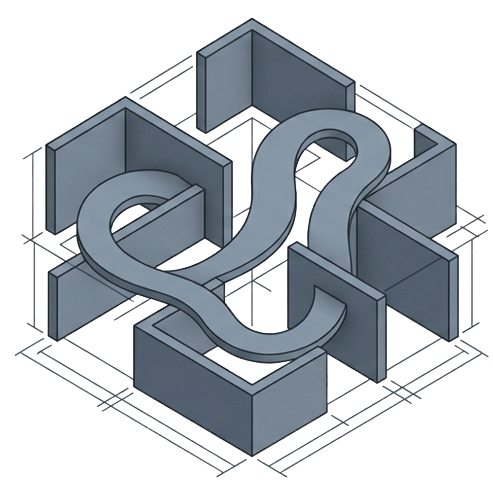
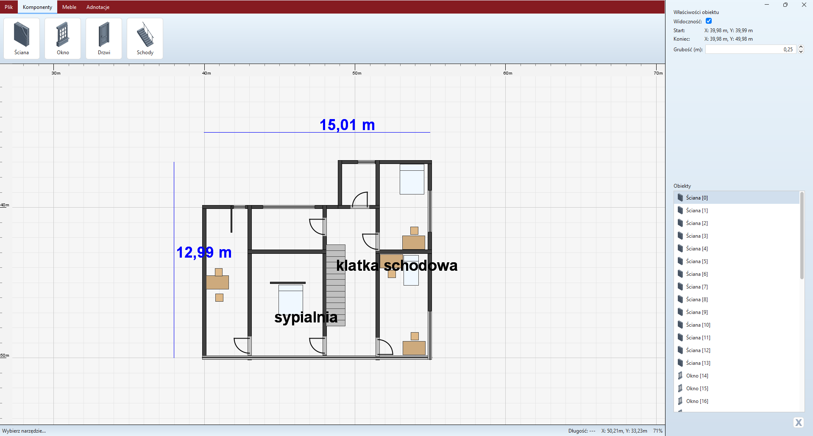

<p align="center">

</p>

# FloorFlow — Desktop Client

A modern Java Swing desktop client designed for comprehensive floor plan layout design. This project was developed as a school assignment to satisfy requirements for a Java desktop application with full CRUD capabilities.

To power the application, the desktop client communicates with a REST API backend.

---

## 🏛️ Client-Server Architecture

This application operates in a client-server topology:

- **Backend (REST API):** A Spring Boot application utilizing Spring Data JPA and MySQL to handle API endpoints and persist layout data.
- **Frontend (Desktop Client):** A Java Swing application utilizing modern look-and-feels, custom coordinate-based drawing viewports, and HTTP client communication to sync project models.

```
+------------------------------------+
|       Java Swing Desktop Client    |
|   (FlatLaf / Viewport / MigLayout) |
+------------------------------------+
                  |
         Asynchronous HTTP (JSON)
                  |
                  v
+------------------------------------+
|      Spring Boot REST Backend      |
|      (Spring Data JPA / Lombok)    |
+------------------------------------+
                  |
                  v
+------------------------------------+
|           MySQL Database           |
+------------------------------------+
```

---

## ✨ Key Features

- **🔐 User Session Management:** Secure registration and login panel connecting to the database server.
- **📁 Project Explorer (CRUD):**
  - List all projects owned by the logged-in user.
  - Create new blank layout designs, rename existing ones, and delete unwanted projects from the server.
- **📐 Interactive 2D Floor Plan Editor:**
  - **Structural Components:** Place and adjust `Walls`, `Doors`, `Windows`, and `Stairs`.
  - **Furniture Library:** Drag, place, and arrange furniture items such as `Beds`, `Chairs`, and `Tables`.
  - **Annotations & Dimension Rulers:** Draw custom text notes directly onto the canvas and stretch dimension lines to measure layout features in real time.
- **⚙️ Properties Inspector Panel:** An interactive sidebar containing fields to inspect and modify settings (visibility, coordinate points, rotation angles, wall thickness, and lengths) for selected floor plan components.
- **🎯 Viewport & Precision Canvas:**
  - Rulers on the top and left margins of the canvas to display coordinates.
  - Infinite grid view supporting zoom-in, zoom-out, and panning.
  - Automatic calculation of lengths and angles during element positioning.
- **🎨 Modern UI/UX Design System:**
  - **FlatMacLightLaf macOS Look & Feel:** Native-looking macOS light interface styling customized specifically for the application.
  - **MigLayout Layouts:** Perfectly aligned controls, headers, toolbars, and responsive side panels.

---

## 🛠️ Tech Stack & Dependencies

- **Language:** Java 22
- **Build System:** Maven
- **Core Libraries & Frameworks:**
  - **FlatLaf Theme:** `flatlaf` for modern LaF styling.
  - **Layout Manager:** `miglayout` for precise grid layouts.
  - **JSON Processing:** Jackson Mapper (`jackson-databind`) & `jackson-datatype-jsr310` to handle serialization of the complex canvas layout data.
  - **Networking:** Native Java HTTP Client.

---


